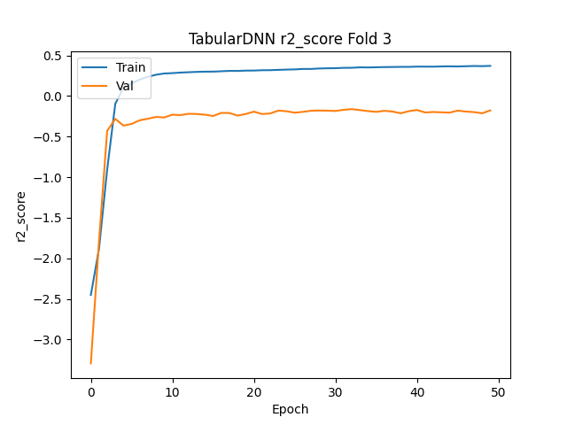
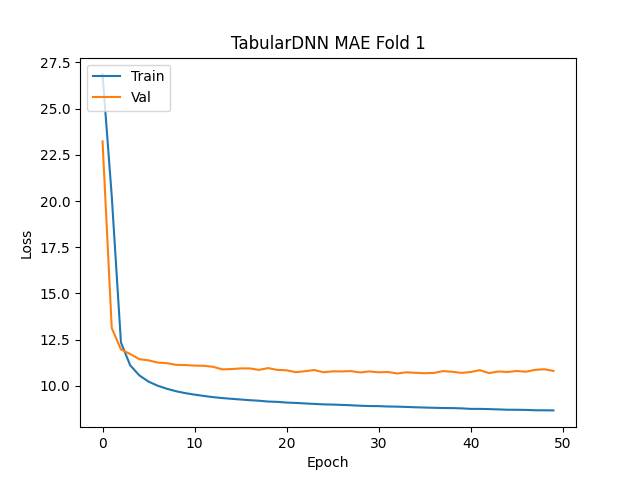

---

## Parameters 

```json
{
    "description": "Test",
    "params": {
        "input_features": [
            "Date",
            "Time",
            "Temperature",
            "Real Feel",
            "Weather Status",
            "Wind Gusts",
            "Humidity",
            "Indoor Humidity",
            "Humidity Status",
            "Dew Point",
            "Pressure",
            "Pressure Direction",
            "Cloud Cover",
            "Visibility",
            "Cloud Ceiling"
        ],
        "output_features": [
            "AQI-PM2.5",
            "AQI-PM10",
            "AQI-NO2",
            "AQI-O3"
        ],
        "hidden_layers": [
            8,
            8
        ],
        "activation": "relu",
        "loss": "MAE",
        "optimizer": "Adam",
        "learning_rate": 0.002,
        "metrics": [
            "r2_score"
        ],
        "normalization_method": "z-score",
        "batch_size": 32,
        "epochs": 50
    }
}
```
### Number of model parameters: 228
## Plots 


### Random Prediction Fold 1

#### Model Prediction Fold 1: [[25.328575 24.87237  11.05278  31.983522]]

#### Model Target Fold 1: [[18. 10.  3. 11.]]


### Random Prediction Fold 2

#### Model Prediction Fold 2: [[16.643814 12.780396 17.436865 14.685657]]

#### Model Target Fold 2: [[25. 16.  8. 16.]]




### Random Prediction Fold 3

#### Model Prediction Fold 3: [[14.25114  14.83076  17.718258 17.793491]]

#### Model Target Fold 3: [[53. 44. 19. 27.]]


### Random Prediction Fold 4

#### Model Prediction Fold 4: [[28.868238  23.51348   37.623775   6.1384354]]

#### Model Target Fold 4: [[17. 20. 27. 16.]]


### Random Prediction Fold 5

#### Model Prediction Fold 5: [[28.232653 26.977201 39.913246 14.923571]]

#### Model Target Fold 5: [[34. 19. 26. 10.]]

#### Model Prediction Loss: 10.795065307617188 ± 0.8475840725203367

#### Model Prediction r2_score: 0.1305023640394211 ± 0.15658909727015285


---

## Parameters 

```json
{
    "description": "Trying 16 nodes in the first hidden layer",
    "params": {
        "input_features": [
            "Date",
            "Time",
            "Temperature",
            "Real Feel",
            "Weather Status",
            "Wind Gusts",
            "Humidity",
            "Indoor Humidity",
            "Humidity Status",
            "Dew Point",
            "Pressure",
            "Pressure Direction",
            "Cloud Cover",
            "Visibility",
            "Cloud Ceiling"
        ],
        "output_features": [
            "AQI-PM2.5",
            "AQI-PM10",
            "AQI-NO2",
            "AQI-O3"
        ],
        "hidden_layers": [
            16,
            8
        ],
        "activation": "relu",
        "loss": "MAE",
        "optimizer": "Adam",
        "learning_rate": 0.002,
        "metrics": [
            "r2_score"
        ],
        "normalization_method": "z-score",
        "batch_size": 32,
        "epochs": 50
    }
}
```
### Number of model parameters: 412
## Plots 




### Random Prediction Fold 1

#### Model Prediction Fold 1: [[32.61244  20.78855  15.718562 16.25773 ]]

#### Model Target Fold 1: [[15.  7. 14. 10.]]


### Random Prediction Fold 2

#### Model Prediction Fold 2: [[28.007725  24.994032  46.168716   8.0457325]]

#### Model Target Fold 2: [[11. 11. 35. 16.]]


### Random Prediction Fold 3

#### Model Prediction Fold 3: [[16.447994 15.304674 19.671682 17.93345 ]]

#### Model Target Fold 3: [[53. 44. 19. 27.]]


### Random Prediction Fold 4

#### Model Prediction Fold 4: [[36.663616 38.26615  21.240982 41.45988 ]]

#### Model Target Fold 4: [[40. 53. 35. 48.]]


### Random Prediction Fold 5

#### Model Prediction Fold 5: [[36.653587 25.891823 14.184615 23.39575 ]]

#### Model Target Fold 5: [[24. 30. 19. 40.]]

#### Model Prediction Loss: 10.71900234222412 ± 0.7085437418406293

#### Model Prediction r2_score: 0.1315695285797119 ± 0.16630071864659368

